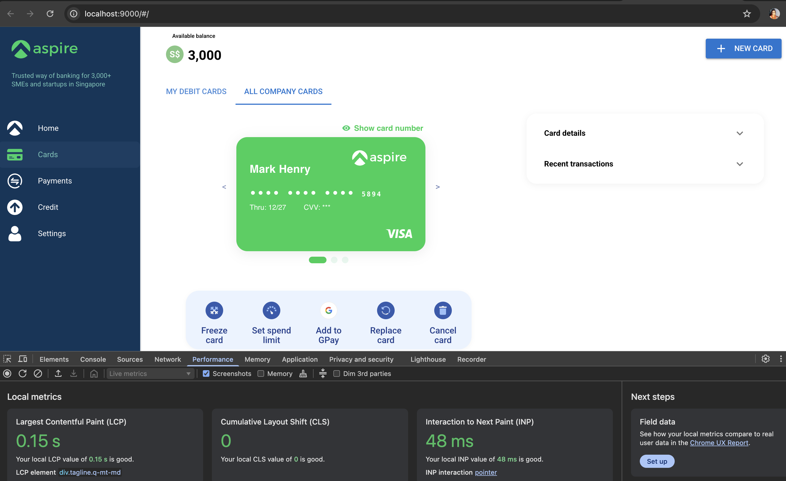

# Quasar App (quasar-project)

Aspire UI project

## Install the dependencies

```bash
npm install
```

## Run on local

```bash
npm run dev
```

## Technologies used

| Technology | Description                         |
| ---------- | ----------------------------------- |
| Vue.js 3   | Progressive JavaScript framework    |
| Vite       | Fast frontend build tool            |
| TypeScript | Typed superset of JavaScript        |
| Quasar     | Vue.js UI framework for SPA/SSR/PWA |
| SCSS       | CSS preprocessor for styling        |
| Vitest     | Unit testing framework              |

## Deployed link

## App Screenshot along with web vitals result:


